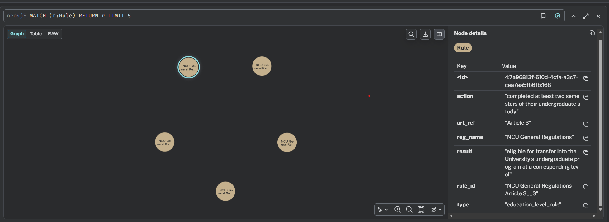
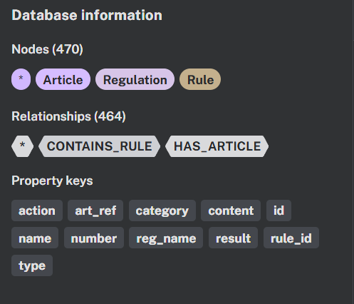

# 🛠️ Prerequisites
Before you begin, ensure you have the following installed:

* Python 3.11 (Strict requirement) 

* Docker Desktop (Required to run the Neo4j database)

* Internet access for first-time HuggingFace model download (local model will be cached)
# ⚙️ Environment Setup
### 1. Database Setup (Neo4j via Docker)

You must run a local Neo4j instance using Docker. Run the following command in your terminal:

` docker run -d --name neo4j -p 7474:7474 -p 7687:7687 -e NEO4J_AUTH=neo4j/password neo4j:latest `

Explanation of flags:

* -d: Runs the container in detached mode (background).

*  -p 7474:7474: Exposes the web interface port (Browser).

*  -p 7687:7687: Exposes the Bolt protocol port (Python connection).

*  -e NEO4J_AUTH=...: Sets the username (neo4j) and password (password).

Verification: After running the command, check if the database is ready:

1. Open your browser and go to http://localhost:7474.

2. Login with user: neo4j and password: password.

### 2. Virtual Environment Setup

It is highly recommended to use a virtual environment to manage dependencies.

**For macOS / Linux:**
```
# Create virtual environment
python -m venv venv

# Activate environment
source venv/bin/activate
```
**For Windows:**
```
# Create virtual environment
python -m venv venv

# Activate environment
venv\Scripts\activate
```

### 3. Install Dependencies

`pip install -r requirements.txt`

# 📂 File Descriptions

* **source/:** Folder containing raw English PDF regulations
* **setup_data.py:** Parses PDFs using pdfplumber and Regex, cleans the text, and stores structured data into a local SQLite database
* **build_kg.py:** Reads from SQLite and executes Cypher queries to create nodes (Regulation, Article) and relationships (HAS_ARTICLE) in Neo4j.
* **query_system.py:** The interactive chatbot. It retrieves full regulation context and uses the LLM to generate answers.
* **auto_test.py:** Runs benchmark questions in test_data.json and uses an "LLM-as-a-Judge" to score your system (Pass/Fail).

# 🚀 Execution Order
**make sure you have already run neo4j in docker**
**run commands in this repository root folder**
1. `python setup_data.py`
2. `python build_kg.py`
3. (Not necessary)`python query_system.py`: Test your system manually to see if it answers correctly.
4. `python auto_test.py`: run the benchmark test  

---

## Report

### 1. KG Construction

The overall flow is:

```
PDF files → setup_data.py → SQLite → build_kg.py → Neo4j KG
```

First, `setup_data.py` reads each PDF using `pdfplumber` and splits the text into articles. ncu1–ncu5 are split by `Article N` headers, while ncu6 (exam rules) is split by numbered items like `1.`, `2.` because it uses a different format.

Then `build_kg.py` goes through each article and asks the LLM to extract rules in JSON:
```
{"rules": [{"type": ..., "action": ..., "result": ...}]}
```

If the LLM output is not valid JSON, we fall back to a simpler method: split the article into sentences and save any sentence that has a number or important keyword as a rule. This way every article is covered. In total, 305 Rule nodes were created.

---

### 2. KG Schema

```
(:Regulation) -[:HAS_ARTICLE]-> (:Article) -[:CONTAINS_RULE]-> (:Rule)
```

**Node properties:**

| Node | Properties |
|------|-----------|
| Regulation | `id`, `name`, `category` |
| Article | `number`, `content`, `reg_name`, `category` |
| Rule | `rule_id`, `type`, `action`, `result`, `art_ref`, `reg_name` |

Two full-text indexes are created for search:
- `article_content_idx` — searches article text
- `rule_idx` — searches rule action and result fields

**Screenshots:**

> Overall graph — Regulation → Article → Rule

*(Insert screenshot)*

```cypher
MATCH (reg:Regulation)-[:HAS_ARTICLE]->(a:Article)-[:CONTAINS_RULE]->(r:Rule)
RETURN reg, a, r LIMIT 30
```

> Exam rules subgraph

*(Insert screenshot)*

```cypher
MATCH (reg:Regulation {name: "NCU Student Examination Rules"})
      -[:HAS_ARTICLE]->(a:Article)-[:CONTAINS_RULE]->(r:Rule)
RETURN reg, a, r LIMIT 20
```

> Rule node properties

*(Insert screenshot — click any Rule node in Neo4j Browser to see its properties)*

---

### 3. Query Design and Retrieval Strategy

When a question comes in, we first figure out which regulation it is about by checking keywords:

| Type | Keywords | Regulation |
|------|----------|-----------|
| `exam_rule` | exam, penalty, cheat, barred | Examination Rules |
| `admin_rule` | easycard, mifare, fee, NTD | Student ID Rules |
| `grade_rule` | credit, graduation, semester, bachelor | General Regulations |
| `general` | (no match) | all |

Then we run three searches and combine the results:

1. **Typed query** — filter by regulation name and rule type (precise)
2. **Full-text on rule_idx** — keyword search across all rules (broader)
3. **Full-text on article_content_idx** — search raw article text (fallback)

After merging, results are re-scored. Rules from the right regulation get a higher score; rules from the wrong degree level (e.g. graduate rules for an undergraduate question) get a lower score.

---

### 4. Failure Analysis

**Final result: 17 / 20 (85%)**

#### Improvement Process

The system went through two main rounds of fixes before reaching the final score.

**Round 1 — from early version to 65% (13/20)**

At this stage, 7 questions were failing: Q3, Q5, Q8, Q9, Q13, Q17, Q18. The main problems were:

- **Wrong regulation targeted** — "forgetting student ID" was classified as an admin question instead of an exam question, so the system searched the wrong regulation entirely. Fixed by adding a secondary keyword check: if the question contains words like "penalty" or "forgot", force it to search the exam rules.
- **Correct rule ranked too low** — the right rule was sometimes ranked 7th–10th and got cut off. Fixed by extending the result window from top 6 to top 10.
- **Chinese number formats not recognized** — the Student ID rules used Chinese characters for amounts (e.g. 壹佰, 貳佰). The LLM could not reliably read these as 100 and 200. Fixed by adding a normalization step before passing evidence to the LLM.
- **LLM gave inconsistent answers for simple facts** — for questions about fees, passing scores, and working days, the LLM sometimes avoided giving a direct answer. Fixed by adding pattern-based direct answers for these question types, bypassing the LLM when the evidence clearly contains the answer.

**Round 2 — from 65% to 85% (17/20)**

After round 1, the remaining failures were mostly caused by the system retrieving articles from the wrong context:

- Q13, Q18: questions about undergraduate rules were retrieving graduate-level articles. Fixed by adding a penalty in the reranking step when the retrieved rule mentions the wrong degree level.
- Q17: the graduate passing score (70) was in the evidence but the LLM still gave a vague answer. Fixed by the direct pattern matching added in round 1.

#### Remaining failures (3 questions)

**Q9 — Fee for Mifare (non-EasyCard) student ID**
- Expected: 100 NTD, Got: 200 NTD
- The evidence contained both values. The EasyCard pattern matched first and returned 200 NTD without checking which card type the question was asking about.

**Q15 — Maximum extension period for undergraduate study**
- Expected: 2 years, Got: "two academic years" (wrong article)
- Two articles both contain "two academic years" — one about study extension, one about leave of absence. The wrong one ranked higher because they share the same keywords.

**Q18 — Condition for dismissal due to poor grades**
- Expected: failing more than half of credits for two semesters, Got: answer about misconduct
- Multiple articles cover different reasons for dismissal. The retrieval picked the misconduct article instead of the grades article.


---
# Screenshots



